# Food-Delivery-Analysis-Project
I analysed a dataset consisting of conditions in which food deliveries takes place, and I added some of my insights over what is the problem and the solution i think might work.
# Food Delivery Time Analysis

What makes food deliveries slow, and what can be done about it? An analysis of 50,000 delivery orders using SQL (PostgreSQL) and Python (pandas, matplotlib, seaborn).

**Short answer:** deliveries are slow because riders move slowly on the road. Heavy traffic is the biggest cause, bad weather adds to it, and vehicle type sets the baseline. The kitchen explains differences between cuisines, but it does not explain the delays caused by rush hour, weather, festivals or location.

## Contents

1. [Dataset](#dataset)
2. [Tools and files](#tools-and-files)
3. [Questions and findings](#questions-and-findings)
4. [Ranking the factors](#ranking-the-factors)
5. [Recommendations](#recommendations)

## Dataset

**Source:** [Food_Delivery_Time_Prediction.csv](Food_Delivery_Time_Prediction.csv)
**Size:** 50,000 orders, 24 columns. Each row is one delivery order.

**What it covers:** order time and date, cuisine, order size, restaurant rating and load, pickup and dropoff zone, road distance, traffic level, weather, vehicle type, rider details, weekend and festival flags, preparation time and total delivery time (`Time_taken_min`).

**Averages:** an order takes about 84 minutes in total, of which about 24 minutes is preparation.

**Cleanliness:** no missing values in any of the 24 columns and no duplicate rows, so no rows were dropped. Column types were checked with `df.info()`.

These graphs give you an idea about the different data used in the analysis and how they are realted to the no of orders and delivery time. 


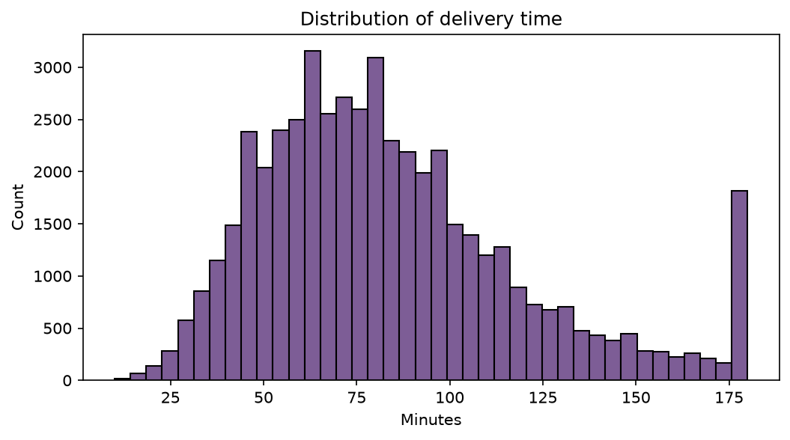

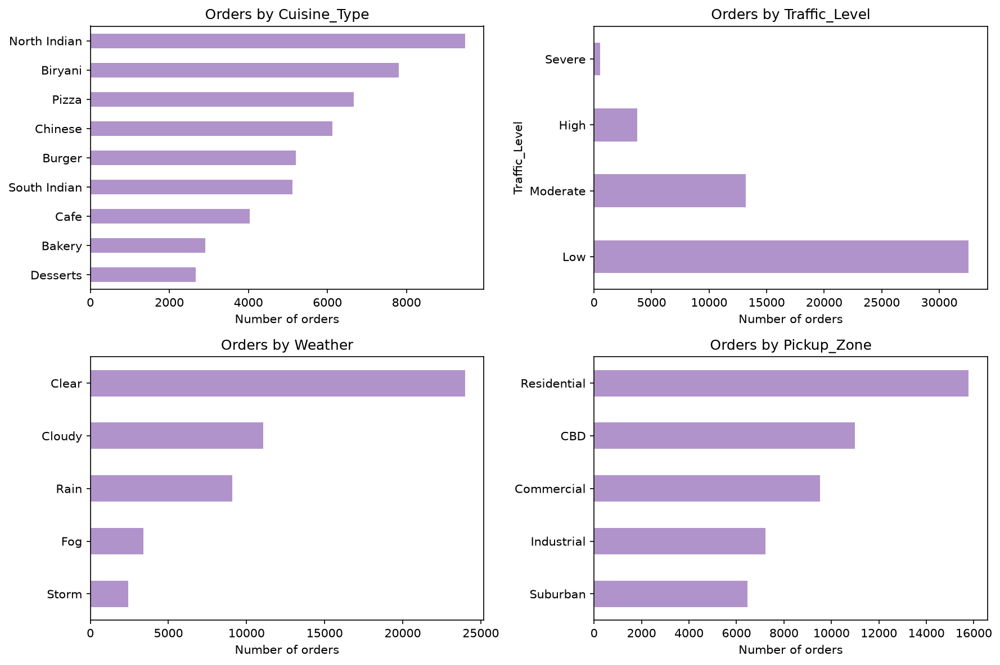


## Tools and files

| Tool | Used for |
|---|---|
| PostgreSQL | first exploration, Q1 to Q20 in `sql/queries.sql` |
| Python (pandas) | the same grouping and averaging, so the notebook runs from the CSV alone |
| matplotlib, seaborn | all charts |

**Why both SQL and Python?** The SQL was how I explored the data. Python reproduces the same results from the CSV so anyone can run it without setting up a database. For a 50,000-row file pandas can do everything SQL did. SQL becomes necessary when data sits in a database that is too large or too spread across tables to load as a CSV.

```
food-delivery-analysis/
├── README.md
├── data/             
├── sql/queries.sql   
├── analysis.ipynb    
└── images/           
```

## Questions and findings

### 1. When do orders come in, and when are deliveries slow?

Orders peak at dinner (18:00 to 20:00, about 25% of all orders) and at lunch (12:00 to 13:00, about 15%). Delivery time does not follow order volume. It spikes at 8 to 10 am and 6 to 9 pm.

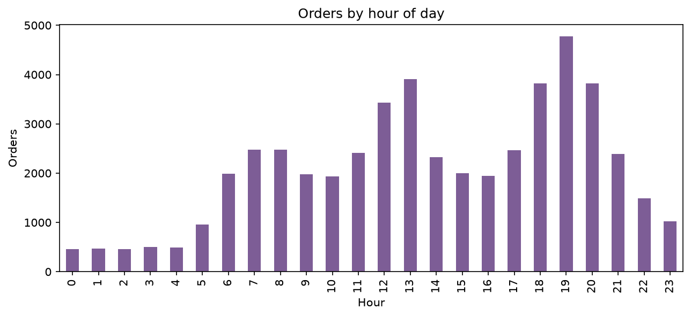

| | Off-peak hours | Rush hours (8 to 10, 18 to 21) |
|---|---|---|
| Average delivery time | about 81 min | about 87 to 89 min |
| Orders in High or Severe traffic | about 2% | about 17% |
| Average rider speed | about 33.3 km/h | about 29.7 km/h |
| Average prep time | about 24 min | about 24 min |
| Average distance | about 26 km | about 26 km |

Prep time and distance are flat all day, so the kitchen and route length are not behind the rush-hour delays.

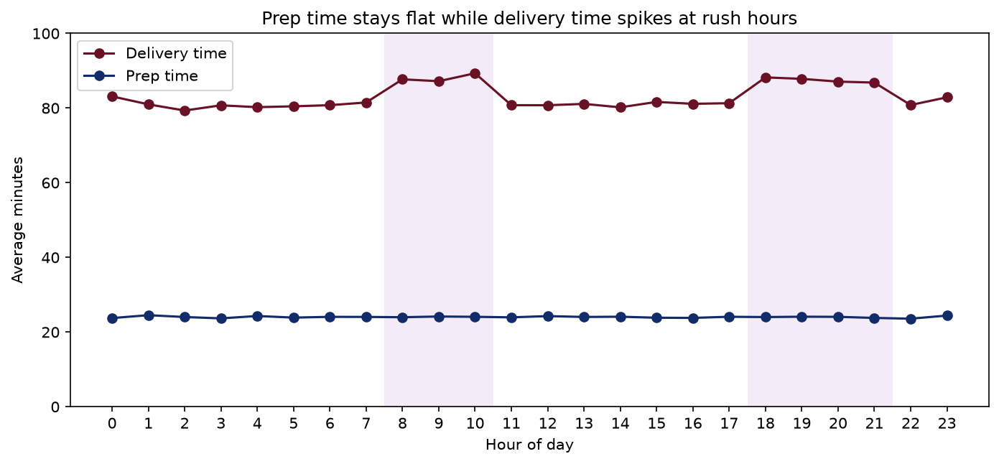

### 2. Is it the time of day, or the traffic?

**Traffic.** At the same traffic level, rush-hour orders are not slower than off-peak orders. Rush hour only matters because it brings heavy traffic: Low-traffic orders fall from about 83% of off-peak orders to about 41% in rush hour.

| Traffic | Off-peak (min) | Rush hour (min) |
|---|---|---|
| Low | 77.1 | 74.6 |
| Moderate | 96.7 | 90.1 |
| High | 119.4 | 110.2 |
| Severe | 135.4 (only 25 orders) | 134.4 |

Going from Low to Severe traffic adds about 60 minutes and cuts rider speed from about 35 to about 15 km/h.

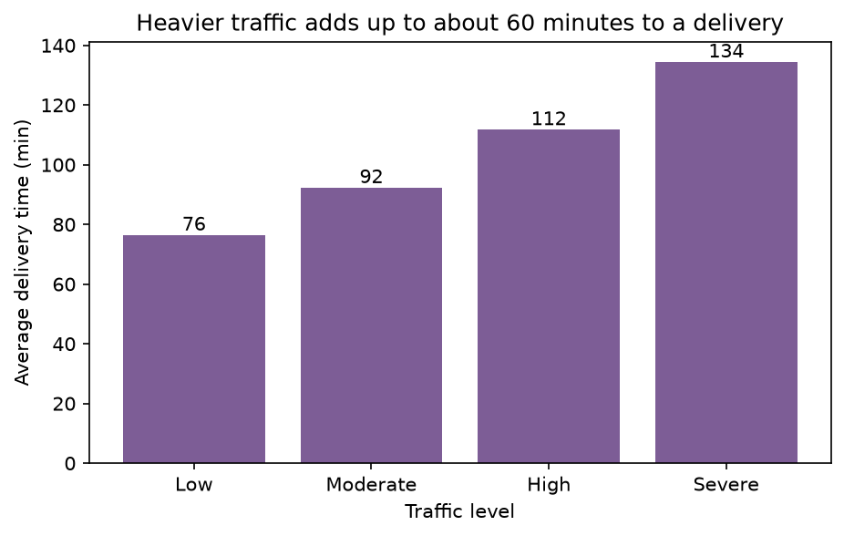

### 3. What does weather add?

Weather has two effects, and they add up:

1. **It creates traffic.** Rain and storm make High or Severe traffic about 7 times more likely (25 to 27% of orders vs about 3.5% in clear weather).
2. **It slows riders directly.** At Low traffic, a storm still adds about 26 minutes (74 min in Clear, 100 in Storm). Fog adds 6 to 9 minutes with no extra traffic at all.

| Weather | Avg delivery (min) | vs Clear |
|---|---|---|
| Clear | 77.3 | baseline |
| Cloudy | 79.0 | +1.7 |
| Fog | 84.2 | +6.9 |
| Rain | 98.9 | +21.6 |
| Storm | 114.5 | +37.2 |

Best case is Clear with Low traffic (74 min). A Storm with High traffic is 131 min.

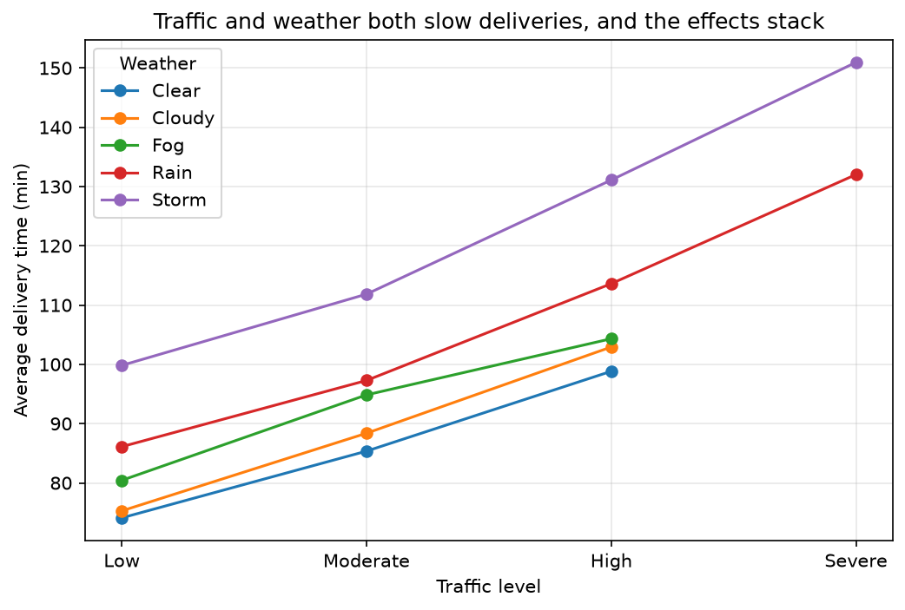

### 4. Which vehicle is fastest?

**Bike, in every weather condition.** The ranking never changes.

| Vehicle | Clear (min) | Storm (min) | Speed in Clear |
|---|---|---|---|
| Bike | 66 | 101 | 41.8 km/h |
| Scooter | 75 | 113 | 33.6 km/h |
| Electric Scooter | 82 | 124 | 29.8 km/h |
| Bicycle | 124 | 156 | 15.9 km/h |

Weather cuts every vehicle's speed by about the same share (about 29% in rain, about 41% in a storm), so no vehicle copes better with bad weather. Bike wins by starting faster. A Bike in a storm (101 min) still beats a Bicycle on a clear day (124 min).

Average route length is about 26 km for every vehicle, so the comparison is fair.

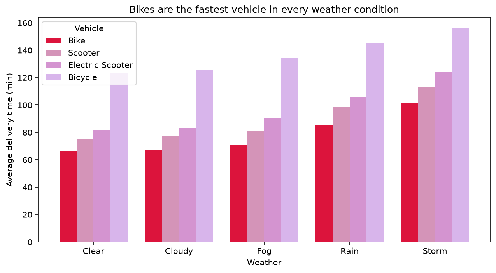

### 5. Why are CBD pickups slow?

Orders picked up in the CBD average 93.8 minutes, about 13 minutes more than other zones (77.9 to 83.3). The CBD has plenty of orders (10,997, about 22% of the total), so this is not a small-sample effect.

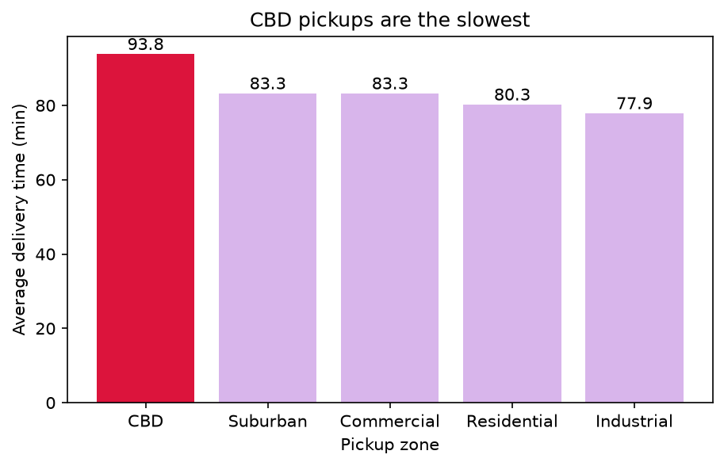

**Where the order goes does not matter.** Every route that starts in the CBD takes about 94 minutes, whatever the dropoff zone.

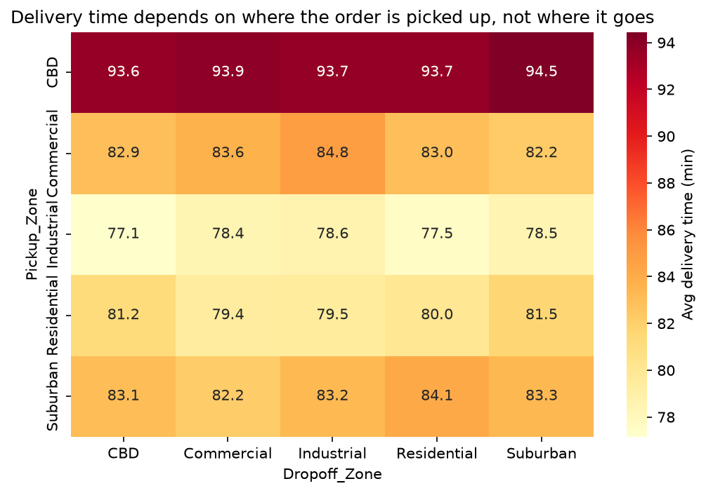

**Traffic is the main reason.** 26% of CBD orders ran in High or Severe traffic, against about 4% in every other zone, and rider speed was 28.4 km/h against about 32.7. At the same traffic level a CBD order takes about as long as an order from any other zone, so the zone matters because of the traffic in it.

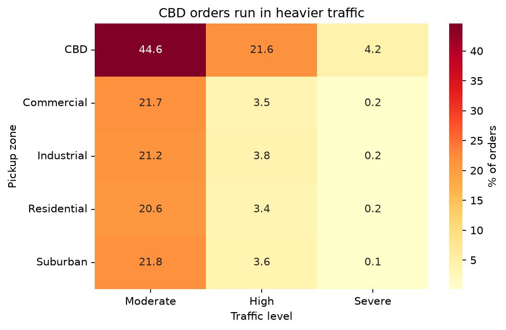

**Prep time adds a smaller part.** CBD orders average 26.4 minutes of prep against about 23 elsewhere. This is not because CBD kitchens are busier or orders larger. It is the cuisine mix: Biryani, North Indian and Pizza (the three slowest to prepare) are about 64% of CBD orders, against about 44% in Residential.

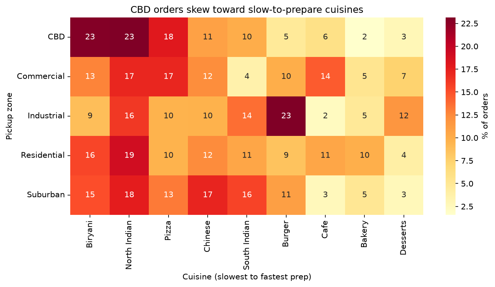

My rough estimate of the split is about 11 minutes from traffic and about 3 from prep.

### 6. Does the cuisine matter?

Yes, and it works through prep time. Biryani takes about 20 minutes longer to deliver than Cafe, and almost all of that is kitchen time. The time after prep is about 59 to 61 minutes for nearly every cuisine.

| Cuisine | Prep (min) | Delivery (min) |
|---|---|---|
| Biryani | 34.2 | 93.6 |
| North Indian | 29.9 | 89.7 |
| Pizza | 26.2 | 86.6 |
| Chinese | 24.0 | 85.0 |
| South Indian | 21.6 | 80.9 |
| Burger | 16.9 | 73.8 |
| Cafe | 14.7 | 73.9 |
| Desserts, Bakery | about 13 | see notebook |

Order size (about 2.6 items) and trip length are the same across cuisines, so neither explains the gap.

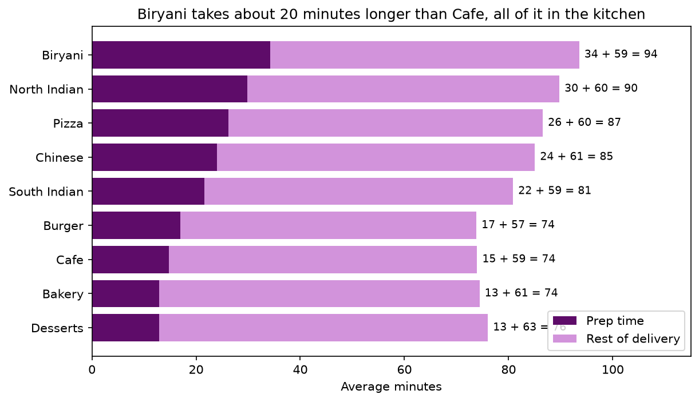


### 7. Weekends and festivals

| | Delivery (min) | Prep (min) | High or Severe traffic |
|---|---|---|---|
| Weekday | 81.6 | 24.0 | 3% |
| Weekend | 89.6 | 24.0 | 22% |
| Normal day | 83.3 | 24.0 | 7% |
| Festival | 95.3 | 24.1 | 33% |

Weekend orders take about 8 minutes longer and festival orders about 12. Prep time is unchanged and heavy traffic is much more common on both, which fits the traffic explanation. 

## Ranking the factors

Approximate size of each effect on delivery time, from largest to smallest:

| Factor | Effect |
|---|---|
| Traffic (Low to Severe) | about 60 min |
| Vehicle (Bike vs Bicycle) | about 58 min |
| Weather (Storm vs Clear) | about 37 min |
| Cuisine (Biryani vs Bakery or Cafe) | about 20 min |
| Order size (7 items vs 1) | about 12 min |
| Festival | about 12 min (seems to be traffic) |
| Weekend | about 8 min (seems to be traffic) |
| Rush hour | about 6 to 8 min (it is traffic) |
| Restaurant load (High vs Low) | about 6 min |
| Rider experience | about 2 to 3 min (left out of the main analysis) |

These effects overlap and are not simply additive across all factors, so use this as a rough ordering.


## Recommendations

1. **Plan around traffic, not time of day.** Quote delivery times from traffic and weather conditions rather than fixed hourly windows.
2. **Add buffers or rider incentives in rain and storms,** especially during rush hours, on weekends, on festivals and for CBD pickups, where heavy traffic is most likely.
3. **Send Bikes first** to long routes, the CBD and bad-weather orders. Keep Bicycles to short trips.
4. **Use cuisine-specific prep estimates.** Biryani needs about 20 minutes more than Cafe or Bakery, and this explains part of the CBD gap.
5. **Next step:** build a model that predicts `Time_taken_min` from traffic, weather, vehicle, cuisine, order size and zone, and check whether it ranks the factors the same way as above.


